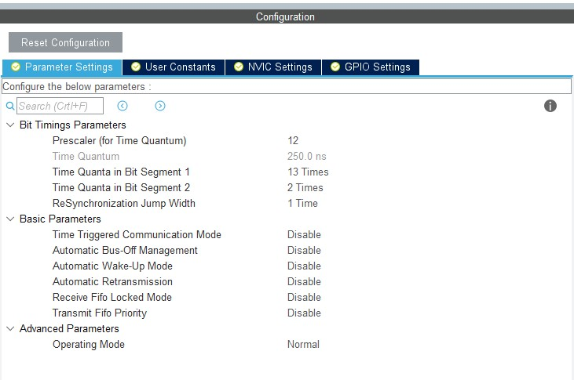
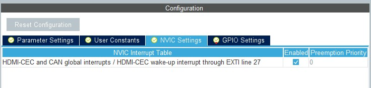
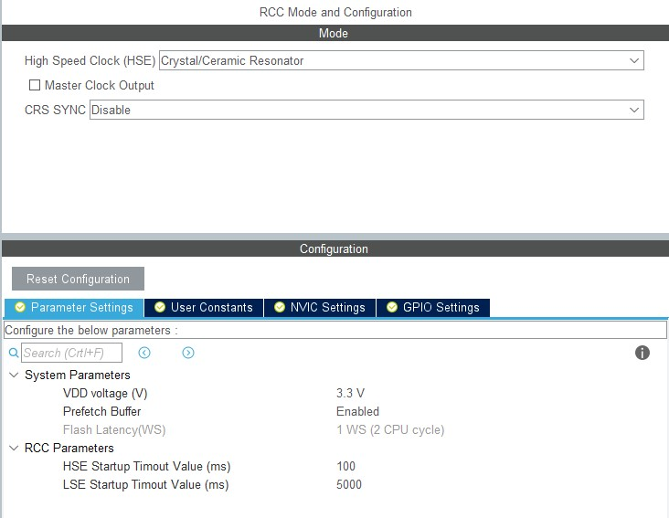
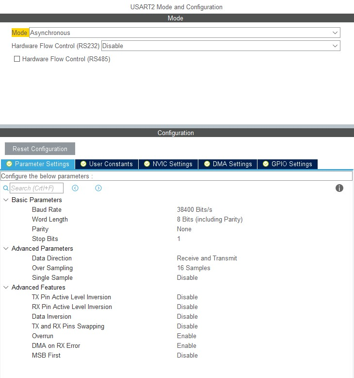

# Read-CAN-STM32

This is my attempt to document the process of configuring STM32 to read CAN data. The board used for this project is a **STM32F042K6 (Nucleo-F042K6)**.

In this project we have used a **Interrupt based** reading mechanism and we print the recieved CAN messages on the Serial Monitor. I have used the [STM32 Truck Shield](https://github.com/gannaramu/STM32F042K6-Shield) from my previous projects. we have used a MCP2562 as a CAN transciever in this project. For more information refer to the [schematic]


## Configuration
1. Configure the Pins.
    * The following image shows the pin configuration used in this project.
    
    

2. Configure the CAN.
    * The CAN Baud rate for this project is **250 kbit/s**. The clock is set to **48Mhz**. The Bit Timing for such configuration is as follows:
    
        | Prescalar | Bit Seg 1 | Bit Seg 2 |
        |:---------:|:---------:|:---------:|
        |    12     |  13       |     2     |
        
        Bit timing for other bit rates can be configured from [http://www.bittiming.can-wiki.info/](http://www.bittiming.can-wiki.info/)
        The configuration should look something like this:
        
        
     * Make sure you enable the Interrupt in the NVIC Settings. The Configuration for the STM32F402K6 looks like this:
        
        
        
 3. Configuring The Clock
     * We use the clock at 48Mhz in order to enable high CAN baudrates. The Clock configuration should look like this:
      
        
        
 4. Configure RCC
      * The RCC configuration should look like this:
      
         
         
 5. Configure UART (for printing messages on serial monitor)
          
          
          
  After the Configuration the IDE should generate a bare code with all the peripharals configured.

## Code

  The CAN Filter is configured inside the **MX_CAN_Init**

   ```C
   /* USER CODE BEGIN CAN_Init 2 */

   CAN_FilterTypeDef sFilterConfig = {0};
   sFilterConfig.FilterBank = 0;
   sFilterConfig.FilterMode = CAN_FILTERMODE_IDMASK;
   sFilterConfig.FilterScale = CAN_FILTERSCALE_32BIT;
   sFilterConfig.FilterIdHigh = 0x0000;
   sFilterConfig.FilterIdLow = 0x0000;
   sFilterConfig.FilterMaskIdHigh = 0x0000;
   sFilterConfig.FilterMaskIdHigh = 0x0000;
   sFilterConfig.FilterFIFOAssignment = CAN_RX_FIFO0;
   sFilterConfig.FilterActivation = ENABLE;
   sFilterConfig.SlaveStartFilterBank = 14;

   if (HAL_CAN_ConfigFilter(&hcan, &sFilterConfig) != HAL_OK){
     Error_Handler();
   }

   if (HAL_CAN_Start(&hcan) != HAL_OK) {
     Error_Handler();
   }
   /* USER CODE END CAN_Init 2 */
   ```

   Make Sure the respective external variables are initialized inside the  **stm32f0xx_it.c** file:
   
   ```C
   /* External variables --------------------------------------------------------*/

   /* USER CODE BEGIN EV */
   extern CAN_HandleTypeDef hcan;
   extern UART_HandleTypeDef huart2;
   extern uint8_t newline[2];
   extern uint8_t space[2];
   /* USER CODE END EV */
   ```
   Inside the **CEC_CAN_IRQHandler** function we call **HAL_CAN_GetRxMessage** to get the message. for more detailed code refer to the file [stm32f00xx_it.c](https://github.com/gannaramu/Read-CAN-STM32/blob/main/Read_CAN/Core/Src/stm32f0xx_it.c#L167-L221)
